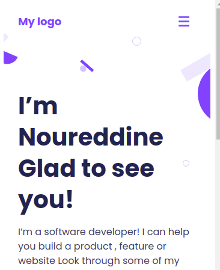
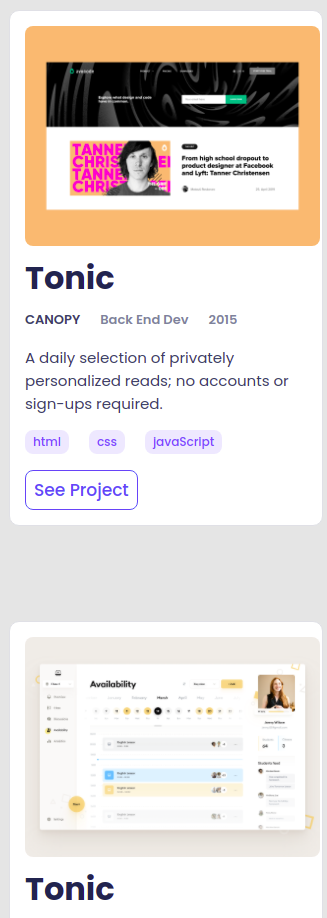

# Portfolio Sketlon Project Documentation

In this project I created a mobile version of a Portfolio integrating some features:
- A header with navigation bar and menu including a logo.
- A presentation section that provides general informations for the portfolio's owner.
- A section to show the projects created by the portfolio's owner.
- 

## Built With

- HTML and CSS
- VSCode

## Authors

- GitHub: [@nmeziany][https://github.com/nmeziany/PortfolioSkeleton]
- linkedIn: [https://www.linkedin.com/in/noureddine-meziany/]